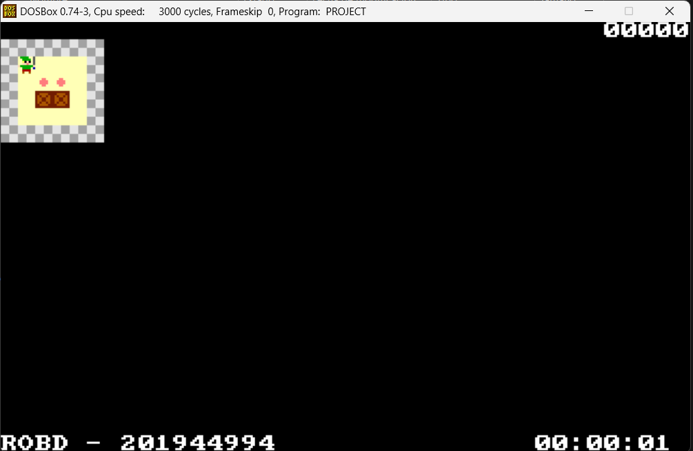
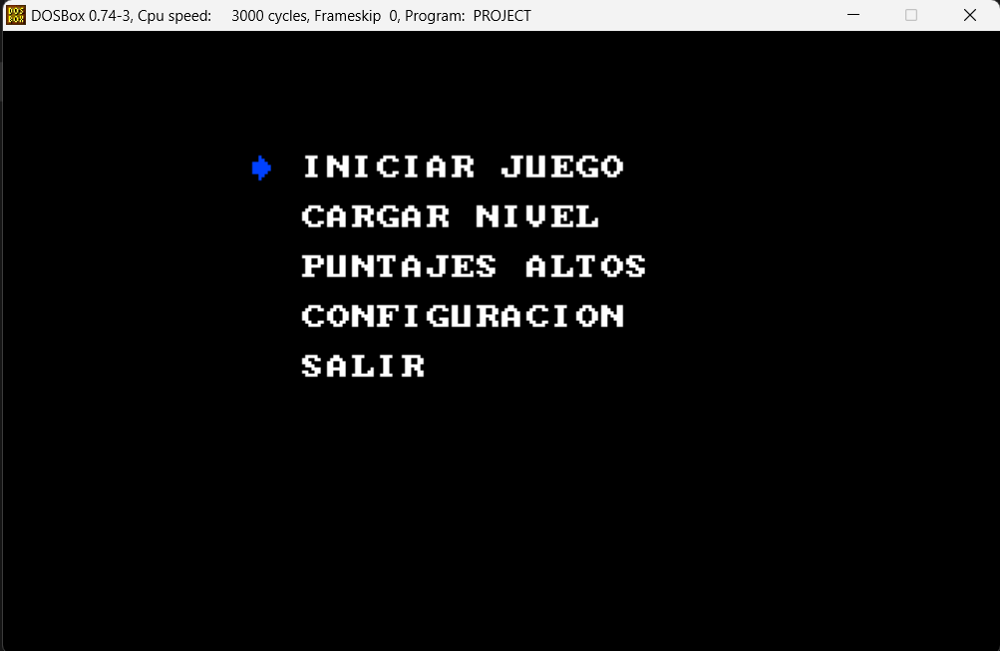

*Universidad de San Carlos de Guatemala*  
*Escuela de Ingeniería en Ciencias y Sistemas, Facultad de Ingenieria*  
*Arquitectura de Computadores y Ensambladores 1, Vacaciones Junio, 2023.*  

___
## **PRACTICA 2**
___
**201944994 - Robin Omar Buezo Díaz**  

#### **Resumen**
Esta aplicación está desarrollado por requerimientos de la Facultad de Ingeniería de la Universidad de San Carlos de Guatemala.

Estos requerimientos consisten en un sistema que pueda utilizarse en un sistema operativo que corra sobre un procesador de 16 bits y que consista en un sistema de punto de venta que permite al usuario tener un catálogo de productos al cual se le puede dar mantenimiento y así mismo la funcionalidad de las ventas y una serie de reportería para poder tener un mejor control de la información.
___
#### **Introducción**  
El presente documento tiene como finalidad mostrar al usuario la funcionalidad y desarrollo del software para que entienda su construcción y pueda dar solución a cualquier error que pueda presentarse.  

Se explican el flujo y las diferentes partes que lo constituyen y cómo debemos de interactuar con este para que nos sea de gran ayuda y podamos sacarle el máximo provecho a nuestra herramienta.

___
___
## **Manual de Usuario**

#### **Pantallas Principales**

##### ***Inicio***
En esta pantalla principal se muestra un encabezado con los datos del desarrollador.

  
 

##### ***Login***
Luego del mensaje inicial estará el login de la aplicación donde el usuario deberá ingresar sus credenciales, en caso de ser incorrectas entonces el sistema se cerrará.

##### ***Menú Principal***
Este será el menú inicial del usuario y le permitirá ingresar a los diferentes modulos que tiene el sistema ingresando la tecla que corresponda a cada uno de ellos, en caso de ingresar una erronea entonces el sistema volverá a mostrar el menú.

  

##### ***Menú Productos***
Este será el módulo de productos, acá el usuario podrá elegir entre crear un producto, eliminar un producto o pedir al sistema que muestre los productos ya ingresados.

   

##### ***Crear Producto***
Está opción le pedirá al usuario los datos correspondientes para poder crear un producto, en caso de que los datos se ingresen de forma incorrecta entonces el sistema volverá a pedir dicha información. En caso de que el artículo ya exista entonces el sistema informará al usuario y no creará el producto.

  

##### ***Eliminar Producto***
Esta opción solicitará al usuario el código del producto a eliminar, en caso de existir se procederá con la eliminación, de lo contrario informará al usuario que dicho producto no se encuentra.

 

##### ***Mostrar Productos***
Esta opción permitirá al usuario poder visualizar los productos que actualmente están ingresados en el sistema. El sistema los mostrará 5 productos y consultará al usuario si quiere seguir viendo otros 5 o si desea salir.

 

##### ***Menú Herramientas***
Este será el módulo donde el usuario podrá generar los reportes del sistema.

##### ***Catálogo de Productos***
Esta opción generará un documento llamado CATALOG.HTM en donde se mostrará el reporte de los productos que están en el sistema con todos sus datos.

 

##### ***Orden Alfabético***
Esta opción generará un documento llamado ABC.HTM en donde se mostrará el reporte de los productos que están en el sistema en orden alfabético.

 

##### ***Productos sin Stock***
Esta opción generará un documento llamado FALTA.HTM en donde se mostrará el reporte de los productos con los que actualmente no se cuenta, es decir, no se tiene stock.

 

___
___
## **Manual Técnico**

#### **Ensamblador**
Para la creación se este software se utilizó el lenguaje ensamblador que nos permite tener un control mucho mas cercano de lo que son los registros del procesador y así mismo de la memoria. 

___
#### **Macros**

##### **print**
Este macro se encarga de escribir en consola la variable que se le de.

~~~
; print - print string with delimiter $
print macro string
    mov DX, offset string
    mov AH, 09
    int 21
endm
~~~

##### **get_string**
Este macro se encarga de guardar el texto ingresado por consola en el buffer que se le de.

~~~
; get_string - get string from keyboard
get_string macro buffer
    mov DX, offset buffer
    mov AH, 0a
    int 21
endm
~~~

___
#### **Subrutinas**
Los structs que modelan los objetos que fueron abstraidos hacia la codificación se explican cada una a continuación:

##### **memset**
Esta subrutina se encarga de setear una cierta cantidad de caracteres de un buffer con un cierto valor, todos estas variables deben ser especificadas por el usuario.

~~~
memset: ;----------------------------------------------Start of memset
        ; Set memory
        ; Input: DI = memory
        ;        CX = length
        ;        AL = value
cycle_memset:
        mov [DI], AL
        inc DI
        loop cycle_memset
        ret
        ;----------------------------------------------End of memset
~~~

##### **compare_string**
Esta subrutina se encarga de comparar cierta cantidad de caracteres de dos buffers, estas variables deben ser especificadas por el usuario.

~~~
compare_string: ;--------------------------------Start of compare_string
        ; Compare two strings
        ; Input: SI = string A
        ;        DI = string B
        ;        CX = length max
        ; Output: DX = 01 if equal
        ;         DX = 00 if not equal
        mov AX, 0000
        mov AL, [SI]
        cmp AL, [DI]
        jne not_equals
        inc SI
        inc DI
        loop compare_string
        mov DX, 01
        ret
not_equals:
        mov DX, 00
        ret     ;--------------------------------End of compare_string  
~~~

##### **get_pressed_key**
Esta subrutina se encarga de capturar la tecla presionada por el usuario.

~~~
get_pressed_key: ;--------------------------------Start of get_pressed_key
        ; Get pressed key
        ; Output: AL = pressed key
        mov AH, 08
        int 21
        ret
        ;--------------------------------End of get_pressed_key 
~~~

##### **copy_string**
Esta subrutina se encarga de copiar cierta cantidad de caracteres de un buffer hacia otro, estas variables deben ser dadas por el usuario.

~~~
copy_string: ;------------------------------------Start of copy_string
        ; Copy string
        ; Input: SI = Source string
        ;        DI = Destination string
        ;        CX = length max
        ; Output: SI = Source string
        ;         DI = Source string
        mov AL, [SI]
        mov [DI], AL
        inc SI
        inc DI
        loop copy_string
        ret
        ;------------------------------------End of copy_string
~~~

##### **string_to_num**
Esta subrutina se encarga de parsear una cadena a un número binario, esta variable debe ser dada por el usuario.

~~~
string_to_num: ;----------------------------------Start of string_to_num
        ; Convert string to int
        ; Input: DI = string
        ; Output: AX = int
        mov AX, 0000
        mov CX, 0005
cycle_string_to_num:
        mov BL, [DI]
        cmp BL, 00
        je end_string_to_num
        sub BL, 30
        mov DX, 000a
        mul DX
        mov BH, 00
        add AX, BX
        inc DI
        loop cycle_string_to_num
end_string_to_num:
        ret
        ;----------------------------------End of string_to_num
~~~

##### **int_to_string**
Esta subrutina se encarga de parsear un numero binario a una cadena de bytes, el numero debe ser dado por el usuario.

~~~
int_to_string: ;------------------------------------Start of int_to_string
        ; Convert int to string
        ; Input: AX = int
        ; Output: [number] = string
        cmp AX, 0000
        je end_int_zero
        mov CX, 0005
        mov DI, offset number
cycle_set30:
        mov BL, 30
        mov [DI], BL
        inc DI
        loop cycle_set30
        
        mov CX, AX
        mov DI, offset number
        add DI, 04
cycle_int_to_string:
        mov BL, [DI]
        inc BL
        mov [DI], BL
        cmp BL, 3a
        je increase_next
        loop cycle_int_to_string
        jmp end_int_to_string
increase_next:
        push DI
increase_next_cycle:
        mov BL, 30
        mov [DI], BL
        dec DI
        mov BL, [DI]
        inc BL
        mov [DI], BL
        cmp BL, 3a
        je increase_next_cycle
        pop DI
        loop cycle_int_to_string
end_int_to_string:
        ret
end_int_zero:
        mov DI, offset number
        mov CX, 0005
        mov AL, 30
        call memset
        ret
        ;------------------------------------End of int_to_string
~~~

##### **print_struct_html**
Esta subrutina se encarga de escribir los datos del producto guardado en memoria, en los reportes que se generan.

##### **write_dash**
Esta subrutina se encarga de escribir una barra en los reportes que se generan.

##### **write_colon**
Esta subrutina se encarga de escribir dos puntos en los reportes que se generan.

##### **write_br**
Esta subrutina se encarga de escribir una etiqueta br en los reportes que se generan.

##### **write_hr**
Esta subrutina se encarga de escribir una etiqueta hr en los reportes que se generan.

##### **write_date**
Esta subrutina se encarga de escribir la fecha en los reportes que se generan.

##### **write_hour**
Esta subrutina se encarga de escribir la hora en los reportes que se generan.

##### **print_alph_product**
Esta subrutina se encarga de escribir los datos del producto guardado en memoria, en el reporte alfabético.

___
#### **Programa**
El resto del programa es manejado por medio de interrupciones y operaciones de memoria.

___
#### **Herramientas**
Para poder dar solución a los requerimientos anteriores se utilizó el lenguaje Ensamblador para poder manejar los registros del procesador de 16 bits.

Para poder emular el sistema MSDOS se utilizó el emulador DOSBox en el cual se estuvo realizando la ejecución de nuestro programa.

Para poder crear el archivo ejecutable de nuestro código se utilizó la herramienta ensamblador, Macro Assembler

Como herramienta de programación se utilizó el programa Visual Studio Code por su amplia funcionalidad y herramientas que brinda a los programadores a la hora de programar en cualquier lenguaje.   

Para poder realizar este documento de utilizó el Lenguaje de marcado Markdown por su manera sencilla de generar documentos de escritura de facil lectura tanto en paginas web como en editores de texto.

Por último, se utilizó la herramienta de versionamiento GitHub. Para poder tener un mejor control sobre los cambios que se iban realizando en nuestro código y no tener el problema de perder funcionalidad si en caso algún cambio ocasionaba erros.

